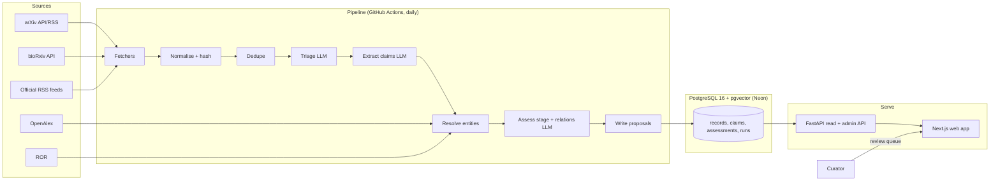
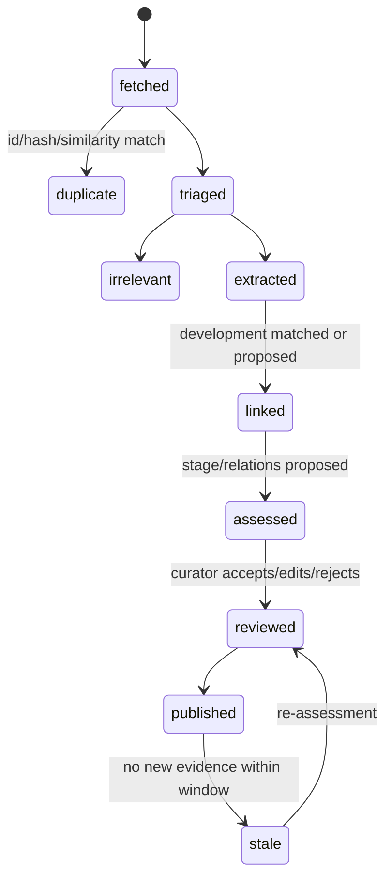

# 06 — Technology Stack, System Architecture and Database Design

**Status:** Phase 1 · **Last updated:** 2026-09-17 · **Owner:** SK

Covers sections I (recommended technology stack), J (system architecture) and K (database design). Decisions are recorded as ADRs in `docs/decisions/`.

---

## I. Recommended technology stack

### I.1 Options considered

| Option | Description | Pros | Cons |
| --- | --- | --- | --- |
| **A. Python backend + TypeScript frontend (chosen)** | FastAPI + SQLAlchemy 2 + Postgres/pgvector; pipeline as a Python package run by a scheduler; Next.js (App Router, TypeScript) frontend | AI/data tooling is Python-native (Anthropic SDK, sentence-transformers, Pydantic); React ecosystem for dense data UI (TanStack Table/Query, shadcn/ui, Recharts); matches SK's existing FastAPI and Next.js 15 experience | Two deployables; two languages to test and lint |
| B. All-Python (FastAPI + Jinja + HTMX) | Single language, server-rendered | Simplest deploy; fewest moving parts | Dense filtering/search UI and later graph views push toward JS anyway; weaker portfolio signal for frontend |
| C. All-TypeScript (Next.js full-stack + Prisma) | One language, Vercel-native | Single deploy; excellent DX | ML/embedding tooling less mature in TS; long-running ingestion does not fit serverless function limits (Vercel Hobby: 5-minute timeout) |
| D. Python + Streamlit | Fastest to a screen | Days to demo | Not a "serious platform" UI; poor URL state, filtering and theming; weak portfolio signal |

**Decision:** Option A. See ADR-0001.

### I.2 The stack

| Layer | Choice | Rationale |
| --- | --- | --- |
| Language (backend/pipeline) | Python 3.12, `uv` for env/deps | Speed of iteration; AI/data libraries |
| API | FastAPI + Pydantic v2 | OpenAPI for free; Pydantic schemas shared with the pipeline |
| ORM / migrations | SQLAlchemy 2 (typed) + Alembic | Mature; explicit migrations reviewed in PRs |
| Database | PostgreSQL 16 with `pgvector` (and built-in full-text search) | One store for relational data, vectors and FTS; recursive CTEs cover graph queries at MVP scale (ADR-0002) |
| Embeddings | `sentence-transformers` with `BAAI/bge-small-en-v1.5` (384-d), CPU | Free; runs in CI; swappable |
| LLM | Anthropic Claude via official SDK; structured outputs; Batch API for bulk | Verified pricing and schema guarantees (see `04-ai-analysis-framework.md`) |
| Scheduling | GitHub Actions `schedule` (daily) running the pipeline CLI; `workflow_dispatch` for manual runs | Free for public repos; no queue/worker infrastructure (ADR-0003). Caveats: runs may be delayed at the top of the hour; schedules auto-disable after 60 days of repo inactivity in public repos; default branch only |
| Frontend | Next.js 15 (App Router, TypeScript), Tailwind, shadcn/ui, TanStack Query + Table, Recharts (charts later), `nuqs` for URL-state filters | SK's existing stack; dense data UI |
| Auth | MVP: single admin bearer token in env for review endpoints; public read is anonymous. Phase 4: Auth.js or Clerk for multi-user | Avoid building auth before it is needed (ADR-0005) |
| Search | MVP: Postgres `tsvector` (weighted: title A, summary B, claims C). Should-have: pgvector HNSW fused with reciprocal rank fusion in SQL. pgvector is used from day one for dedup regardless | Single database; good enough for < 1M rows |
| Testing | `pytest` + `pytest-asyncio`; Postgres via Docker service in CI; `hypothesis` for parsers; Vitest + Playwright (Phase 3) | — |
| Quality | `ruff`, `mypy --strict` on `core/` and `pipeline/`, `pre-commit`; ESLint + TypeScript strict | — |
| Logging | `structlog` JSON to stdout; request IDs; pipeline run IDs | — |
| Monitoring | Sentry free tier (API + web); GitHub Actions run status; a `/health` endpoint; cost table in DB | Free |
| Hosting (MVP) | Frontend: Vercel Hobby. API: Render free web service (spins down after 15 min idle; 750 instance-hours/month) or a $5–7/month always-on instance if spin-down hurts demos. DB: Neon Free (0.5 GB storage, 100 CU-hours/month, scale-to-zero after 5 min). Pipeline: GitHub Actions | All free; total under budget. Render's free Postgres expires after 30 days, so Neon holds the data |
| Local dev | Docker Compose: Postgres+pgvector; `make dev` runs API + web; `.env.example` | Reproducible |

Verified on 2026-09-17: Neon Free plan limits ([Neon FAQ](https://neon.com/faqs/free-plan-limits-and-quotas)); Render free tier and other platforms ([Render, 2026](https://render.com/articles/platforms-with-a-real-free-tier-for-developers-in-2026)); GitHub Actions free for public repositories on standard runners, 2,000 min/month for private ([GitHub docs](https://docs.github.com/en/billing/managing-billing-for-your-products/about-billing-for-github-actions)); schedule caveats ([Cronuru guide](https://cronuru.com/guides/github-actions-scheduled-workflows)).

### I.3 Repository structure

Implemented in Sprint 0. The Phase 1 sketch had three separate distributions
under `packages/` (`core`, `pipeline`, `api`); that was changed to one
distribution with subpackages under `src/radar/` because all three share a
dependency set and ship together — the pipeline runs in GitHub Actions and the
API on Render, both from this one repository. Separate distributions would have
required uv workspace tooling and three `pyproject.toml` files to buy nothing.
Imports read `from radar.core.models import Source`.

```
futuretech-radar/
├── README.md
├── PROJECT-STATUS.md            # living task list, debt, gaps
├── LICENSE (MIT) · DATA-LICENSE.md (CC BY 4.0) · SECURITY.md
├── docs/                        # this document set + decisions/
├── sources.yaml                 # source registry              (Sprint 0 Task 3)
├── seeds/                       # technologies, domains, aliases (Sprint 2)
├── eval/                        # labelled sets + eval runner    (Sprint 1)
├── src/radar/
│   ├── core/                    # settings, db, types, models/
│   ├── pipeline/                # fetchers, normalise, dedupe, extract, assess, prompts, cli
│   └── api/                     # FastAPI: routers, deps, auth   (Sprint 3)
├── migrations/                  # Alembic env + versions/
├── tests/
├── web/                         # Next.js app                    (Sprint 3)
├── infra/                       # docker-compose.yml, initdb/
├── .github/workflows/           # ci.yml, ingest-daily.yml, eval.yml
├── alembic.ini · pyproject.toml · uv.lock · Makefile · .env.example
```

---

## J. System architecture

### J.1 Component view



Reading: sources are polled by a scheduled job that writes only *proposals* and raw documents; the API serves published records and exposes the review queue; the curator's decisions are the only path from proposed to confirmed for high-stakes fields.

### J.2 Document lifecycle



### J.3 Request path (public)

Browser → Vercel (Next.js, server components fetch) → API (FastAPI) → Postgres. Public pages are cached at the edge for 10 minutes; the daily batch invalidates on completion. No user data is collected on the public path.

### J.4 Ingestion architecture

- One CLI entry point: `radar ingest --since 1d`, `radar extract --pending`, `radar assess --technology <id>`, `radar eval`.
- Fetchers implement a `Fetcher` protocol: `discover(since) -> Iterable[RawDoc]`; each has a rate limiter from `sources.yaml` and a `fetch_run` row with counts and errors.
- Idempotency: `source_document` is unique on `(source_id, external_id)` and on `content_hash`.
- Failure isolation: one source failing does not stop the run; errors are recorded per source and surfaced in the curator dashboard.
- Backfill: `radar ingest --since 90d --source arxiv-quant-ph` for seeding, respecting the 3-second arXiv interval (≈ 1,200 requests/hour ceiling).

### J.5 Citation system

A `claim` is the citation. Every rendered claim shows: quote, source document title, publisher (source), publication date, retrieval date, tier, canonical ID and outbound link. Generated summaries render inline superscripts linking to claim IDs. Exports include claim IDs and source URLs. A `claim` is never deleted; it is `retracted` with a reason (versioning).

### J.6 Automated reports, notifications, analytics (Phase 4 hooks)

The schema already records the events reports and alerts need: `maturity_assessment` versions (stage changes), `claim` conflicts, `development` creation. Phase 4 adds a `notification_rule` table and a weekly digest job; no MVP code path needs to change. Product analytics in the MVP: none beyond server logs; a privacy-friendly counter (Plausible or self-hosted Umami) can be added later.

### J.7 Backup and recovery

Neon provides point-in-time restore within the plan's retention window; in addition, the daily pipeline job ends by exporting a compressed `pg_dump` to a private GitHub Release asset or an S3-compatible bucket (Cloudflare R2 free tier), retaining 14 daily copies. Restore is documented and tested once in Phase 3 (`make restore FILE=...`). Because every source document is re-fetchable and every AI output is reproducible from `analysis_run` inputs, the only irreplaceable data is curator decisions — the `review_action` and `maturity_assessment` tables are additionally exported as CSV in the same backup.

---

## K. Database design

### K.1 Entity-relationship overview

```mermaid
erDiagram
  SOURCE ||--o{ SOURCE_DOCUMENT : publishes
  SOURCE_DOCUMENT ||--o{ CLAIM : yields
  DEVELOPMENT ||--o{ CLAIM : groups
  DEVELOPMENT }o--o{ TECHNOLOGY : concerns
  DEVELOPMENT }o--o{ ORGANIZATION : involves
  TECHNOLOGY }o--|| DOMAIN : belongs_to
  TECHNOLOGY ||--o{ TECHNOLOGY_ALIAS : has
  TECHNOLOGY ||--o{ MATURITY_ASSESSMENT : assessed_by
  TECHNOLOGY ||--o{ IMPORTANCE_RATING : rated_by
  TECHNOLOGY ||--o{ TECHNOLOGY_RELATION : from
  TECHNOLOGY ||--o{ TECHNOLOGY_RELATION : to
  CLAIM ||--o{ ASSESSMENT_EVIDENCE : supports
  MATURITY_ASSESSMENT ||--o{ ASSESSMENT_EVIDENCE : cites
  ANALYSIS_RUN ||--o{ CLAIM : produced
  ANALYSIS_RUN ||--o{ MATURITY_ASSESSMENT : produced
  REVIEW_TASK ||--o{ REVIEW_ACTION : resolved_by
```

### K.2 Tables (schema v0)

Conventions: UUID primary keys; `created_at`/`updated_at` everywhere; soft-delete via `status` not row deletion; all AI-produced rows carry `analysis_run_id`; all human-edited rows carry `review_action_id`.

```sql
-- Source registry (mirrors sources.yaml)
CREATE TABLE source (
  id            text PRIMARY KEY,               -- 'arxiv-cs-ro'
  name          text NOT NULL,
  kind          text NOT NULL,                  -- arxiv_category | rss | biorxiv | openalex | ror
  tier          text NOT NULL CHECK (tier IN ('T1','T2','T3','T4')),
  params        jsonb NOT NULL DEFAULT '{}',
  schedule      text NOT NULL DEFAULT 'daily',
  licence_note  text,
  domains       text[] NOT NULL DEFAULT '{}',
  active        boolean NOT NULL DEFAULT true
);

CREATE TABLE fetch_run (
  id            uuid PRIMARY KEY,
  source_id     text REFERENCES source(id),
  started_at    timestamptz NOT NULL,
  finished_at   timestamptz,
  status        text NOT NULL,                  -- running | ok | error
  fetched_count int NOT NULL DEFAULT 0,
  new_count     int NOT NULL DEFAULT 0,
  error         text
);

CREATE TABLE source_document (
  id              uuid PRIMARY KEY,
  source_id       text NOT NULL REFERENCES source(id),
  external_id     text NOT NULL,                -- arXiv id, DOI, feed guid; falls back to url
  canonical_ids   jsonb NOT NULL DEFAULT '{}',  -- {doi, arxiv, openalex, s2}
  url             text NOT NULL,
  title           text NOT NULL,
  authors         jsonb,
  published_at    timestamptz,
  retrieved_at    timestamptz NOT NULL,
  abstract        text,
  content_text    text,                         -- transient; nullable; licence-gated
  content_hash    text NOT NULL,
  licence         text,
  tier_override   text,
  lifecycle       text NOT NULL DEFAULT 'fetched', -- fetched|duplicate|irrelevant|extracted|linked|assessed
  duplicate_of    uuid REFERENCES source_document(id),
  fetch_run_id    uuid REFERENCES fetch_run(id),
  search_tsv      tsvector GENERATED ALWAYS AS (to_tsvector('english', coalesce(title,'') || ' ' || coalesce(abstract,''))) STORED,
  UNIQUE (source_id, external_id)
  -- content_hash is indexed, NOT unique: see the note in K.3.
);
CREATE INDEX ON source_document USING gin (search_tsv);
CREATE INDEX ON source_document (published_at DESC);

-- Self-review 2026-09-17: a separate document_chunk table was removed from v0.
-- The MVP embeds one vector per document (title + abstract); chunk-level
-- embeddings are a Phase 4 addition if full-text extraction for featured
-- technologies is adopted.
ALTER TABLE source_document ADD COLUMN embedding vector(384);
CREATE INDEX ON source_document USING hnsw (embedding vector_cosine_ops);

CREATE TABLE domain (
  id            text PRIMARY KEY,               -- 'quantum'
  name          text NOT NULL,
  description   text
);

CREATE TABLE technology (
  id              uuid PRIMARY KEY,
  slug            text UNIQUE NOT NULL,
  name            text NOT NULL,
  domain_id       text NOT NULL REFERENCES domain(id),
  scope_note      text NOT NULL,                -- what is and is not included
  description     text,                         -- curator-written
  openalex_query  jsonb,                        -- for research-activity metric
  featured        boolean NOT NULL DEFAULT false,
  status          text NOT NULL DEFAULT 'proposed', -- proposed | active | merged | retired
  merged_into     uuid REFERENCES technology(id),
  embedding       vector(384),
  search_tsv      tsvector GENERATED ALWAYS AS (to_tsvector('english', name || ' ' || coalesce(description,''))) STORED
);
CREATE TABLE technology_alias (
  technology_id uuid REFERENCES technology(id),
  alias         text NOT NULL,
  PRIMARY KEY (technology_id, alias)
);

CREATE TABLE organization (
  id            uuid PRIMARY KEY,
  ror_id        text UNIQUE,                    -- null only for orgs absent from ROR (startups)
  name          text NOT NULL,
  kind          text,                           -- university | company | government | lab | nonprofit | consortium
  country       text,
  website       text,
  aliases       text[] NOT NULL DEFAULT '{}',
  status        text NOT NULL DEFAULT 'proposed'
);

CREATE TABLE development (
  id              uuid PRIMARY KEY,
  slug            text UNIQUE NOT NULL,
  title           text NOT NULL,
  kind            text NOT NULL,                -- paper | demonstration | pilot | product | regulatory | funding | other
  occurred_on     date,
  occurred_basis  text,                         -- document_metadata | quoted_text
  summary         text,                         -- generated; labelled in UI
  summary_run_id  uuid,
  summary_stale   boolean NOT NULL DEFAULT false,
  status          text NOT NULL DEFAULT 'proposed',
  embedding       vector(384),
  search_tsv      tsvector GENERATED ALWAYS AS (to_tsvector('english', title || ' ' || coalesce(summary,''))) STORED
);
CREATE TABLE development_technology (
  development_id uuid REFERENCES development(id),
  technology_id  uuid REFERENCES technology(id),
  PRIMARY KEY (development_id, technology_id)
);
CREATE TABLE development_organization (
  development_id  uuid REFERENCES development(id),
  organization_id uuid REFERENCES organization(id),
  role            text NOT NULL,                -- developer | partner | funder | evaluator | regulator
  PRIMARY KEY (development_id, organization_id, role)
);

CREATE TABLE claim (
  id               uuid PRIMARY KEY,
  document_id      uuid NOT NULL REFERENCES source_document(id),
  development_id   uuid REFERENCES development(id),
  text             text NOT NULL,               -- normalised claim
  quote            text NOT NULL,               -- verbatim; verified substring
  quote_verified   boolean NOT NULL,
  claim_type       text NOT NULL,               -- see D.3
  date_referenced  date,
  date_basis       text,
  metrics          jsonb,                       -- [{name, value, unit}]
  subjects         jsonb,                       -- mentions: [{kind, surface, resolved_id}]
  epistemic_label  text NOT NULL,               -- observed_fact | source_expectation | expert_forecast
  status           text NOT NULL DEFAULT 'proposed', -- proposed | confirmed | rejected | retracted
  conflicts_with   uuid[] NOT NULL DEFAULT '{}',
  analysis_run_id  uuid NOT NULL,
  review_action_id uuid,
  search_tsv       tsvector GENERATED ALWAYS AS (to_tsvector('english', text)) STORED
);
CREATE INDEX ON claim (development_id);
CREATE INDEX ON claim USING gin (search_tsv);

CREATE TABLE maturity_assessment (
  id               uuid PRIMARY KEY,
  subject_type     text NOT NULL,               -- technology | development
  subject_id       uuid NOT NULL,
  version          int NOT NULL,
  stage            text,                        -- M0..M8 or NULL when insufficient
  insufficient     boolean NOT NULL DEFAULT false,
  confidence       text,                        -- high | medium | low
  rationale        text NOT NULL,
  criteria         jsonb NOT NULL,              -- [{criterion, claim_ids[]}]
  assessor_type    text NOT NULL,               -- model | human
  assessor_id      text NOT NULL,               -- model id or user id
  prompt_version   text,
  analysis_run_id  uuid,
  review_action_id uuid,
  status           text NOT NULL,               -- proposed | confirmed | superseded | rejected
  assessed_at      timestamptz NOT NULL,
  UNIQUE (subject_type, subject_id, version)
);
CREATE TABLE assessment_evidence (
  assessment_id uuid REFERENCES maturity_assessment(id),
  claim_id      uuid REFERENCES claim(id),
  criterion     text NOT NULL,
  PRIMARY KEY (assessment_id, claim_id, criterion)
);

CREATE TABLE importance_rating (
  id               uuid PRIMARY KEY,
  technology_id    uuid NOT NULL REFERENCES technology(id),
  dimension        text NOT NULL,               -- six dimensions from 03-...md
  value            text,                        -- low | medium | high | unassessed
  rationale        text NOT NULL,
  evidence_claim_ids uuid[] NOT NULL DEFAULT '{}',
  version          int NOT NULL,
  assessor_type    text NOT NULL,
  assessor_id      text NOT NULL,
  status           text NOT NULL,
  UNIQUE (technology_id, dimension, version)
);

CREATE TABLE technology_relation (
  id               uuid PRIMARY KEY,
  from_id          uuid NOT NULL REFERENCES technology(id),
  to_id            uuid NOT NULL REFERENCES technology(id),
  relation_type    text NOT NULL,               -- depends_on | enables | bottlenecked_by | competes_with | complements
  rationale        text,
  evidence_claim_ids uuid[] NOT NULL DEFAULT '{}',
  status           text NOT NULL DEFAULT 'proposed',
  analysis_run_id  uuid,
  review_action_id uuid,
  UNIQUE (from_id, to_id, relation_type)
);

CREATE TABLE analysis_run (
  id             uuid PRIMARY KEY,
  stage          text NOT NULL,                 -- triage | extract | dedupe | assess | relate | summarise
  model_id       text NOT NULL,
  prompt_version text NOT NULL,                 -- git SHA of prompt file
  input_ids      uuid[] NOT NULL,
  raw_output     jsonb,
  tokens_in      int, tokens_out int, cost_usd numeric(10,6),
  duration_ms    int,
  status         text NOT NULL,                 -- ok | schema_error | refusal | error
  error          text,
  created_at     timestamptz NOT NULL
);

CREATE TABLE review_task (
  id           uuid PRIMARY KEY,
  target_type  text NOT NULL,                   -- claim | technology | organization | assessment | relation | correction
  target_id    uuid NOT NULL,
  reason       text NOT NULL,                   -- new_entity | high_stage | conflict | low_confidence | user_report
  priority     int NOT NULL DEFAULT 0,
  status       text NOT NULL DEFAULT 'open',
  created_at   timestamptz NOT NULL
);
CREATE TABLE review_action (
  id           uuid PRIMARY KEY,
  task_id      uuid REFERENCES review_task(id),
  actor_id     text NOT NULL,
  action       text NOT NULL,                   -- accept | edit | reject | merge | retract
  before       jsonb, after jsonb,              -- field-level diff
  note         text,
  created_at   timestamptz NOT NULL
);

CREATE TABLE research_activity (
  technology_id uuid REFERENCES technology(id),
  year          int NOT NULL,
  works_count   int NOT NULL,
  institutions_count int NOT NULL,
  query         jsonb NOT NULL,
  computed_at   timestamptz NOT NULL,
  PRIMARY KEY (technology_id, year, computed_at)
);
```

### K.3 Design notes

- **Versioning without a generic history table.** Assessments and ratings are append-only with `version`; claims are never mutated after confirmation (edits create a new claim and retract the old). `review_action.before/after` gives field-level history for everything else. This is simpler than triggers or temporal tables and sufficient for the MVP.
- **Graph in Postgres.** `technology_relation` is an edge table; 2–3 hop dependency queries use recursive CTEs. A graph database is unjustified below ~10⁵ edges (ADR-0002).
- **Vectors in Postgres.** 384-d embeddings with HNSW, one per document, technology and development; at MVP scale (< 50k rows) query latency is milliseconds. Neon's 0.5 GB storage is the binding constraint: 50k document vectors × 384 × 4 bytes ≈ 77 MB plus abstracts; full-text `content_text` is transient (cleared after extraction) so it does not accumulate.
- **Two corrections made while implementing schema v0 (Sprint 0).** `external_id` is `NOT NULL`: PostgreSQL treats NULLs as distinct in a unique constraint, so a nullable column would have let a re-run insert duplicate rows, defeating the idempotency the ingestion job depends on; fetchers fall back to the canonical URL when a feed supplies no identifier. And `content_hash` is indexed but **not** unique, because a unique constraint contradicts `duplicate_of`: identical content legitimately arrives from two sources (a syndicated press release), and that must be recorded as a duplicate row pointing at the original, not rejected with an integrity error.
- **Conflicts.** `claim.conflicts_with` is populated by a rule (same development, same metric name, values differ beyond tolerance, or contradictory claim types) plus reviewer action; conflicts create review tasks and are shown publicly as "sources disagree".
- **Staleness.** Computed at read time from the latest confirmed assessment's `assessed_at` and the stage's window; no background job needed.
- **Full text.** `content_text` is nullable and cleared after extraction for documents whose licence does not permit storage; a nightly job enforces this.
